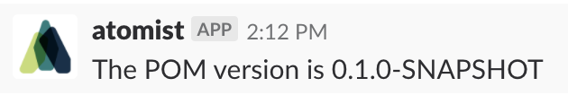

# Adding code inspection commands

Atomist can react to events, but also to commands you can give it. For example, a command you can give Atomist out of the box is:

```
@atomist hello atomist/node-automation
```

This will return the information of the `node-automation` automation client. If you want to see the commands the Atomist bot can understand, you can issue the following command:

```
@atomist list skills
```

Commands can do many things. They can trigger internal SDM behavior or call external services. If it's an action you can automate, you can turn it into a command.

# Creating your own command

Let's say we want to create a command to quickly query what the current version is in a POM xml. Atomist has a couple of command types, one of which is a code inspection command.

We first make an inspection

``` typescript
export const PomVersionCommandHandler: CodeInspectionRegistration<any> = {
    name: "Get POM version",
    description: "Get POM version",
    intent: ["get pom version"],
    inspection: async (p: Project, ctx: SdmContext) => {
        const pom = p.findFileSync("pom.xml");
        const parser = new xml2js.Parser();
        return promisify(parser.parseString)(pom.getContentSync())
            .then((parsed: any) => {
                if (!!parsed.project) {
                    const projectVersion = parsed.project.version[0];
                    const message = `The POM version is ${projectVersion}`;
                    return sendMessage(ctx, message);
                } else {
                    return sendMessage(ctx, "The project has no valid POM");
                }
            });
    },
};

function sendMessage(ctx: SdmContext, message: string) {
    const slackChannel = _.get(ctx.context, "source.slack.channel.name");
    return ctx.context.messageClient.addressChannels(message, slackChannel);
}
```

And register the command handler in our SDM:

``` typescript
sdm.addCodeInspectionCommand(PomVersionInspection);
```

If we now run our SDM and give Atomist the command:

```
@atomist get pom version
```

It will return this:


