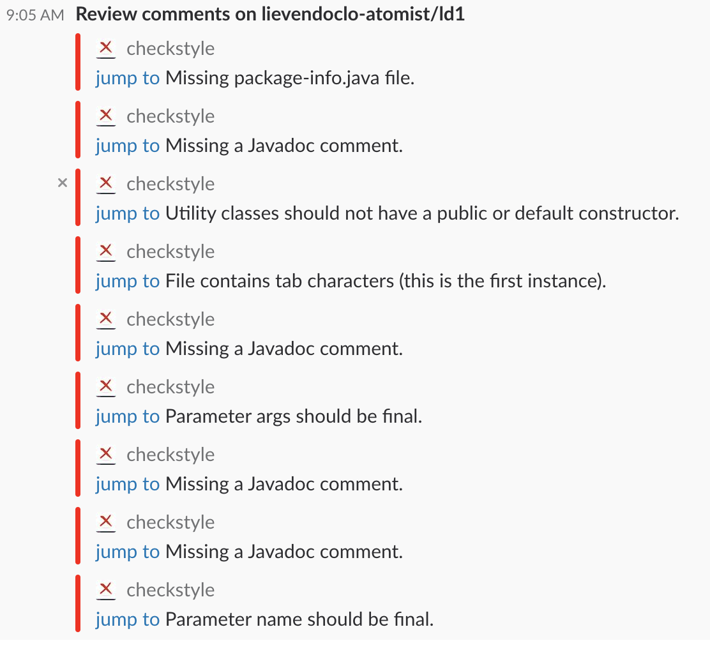

# Adding non-build behavior: the Checkstyle extension

Atomist is not only able to handle build and deploy scenario's. It can perform just about any action that's related to your code. 

One of these things is Checkstyle integration. Checkstyle checks whether your code is written correctly according to the styleguide of your organisation. Enabling this in your SDM is dead easy. 

First, add the extension pack to your `package.json`:

``` bash
npm install --save @atomist/sdm-pack-checkstyle
```

Next, install the extension pack in your SDM configuration:

``` typescript
import { CheckStyleSupport } from "@atomist/sdm-pack-checkstyle";

sdm.addExtensionPack(CheckStyleSupport);
```

To finish, add some configuration in your client configuration (which resides in `~/.atomist/client-config.json`):

``` json
{
    "sdm": {
        "checkstyle": {
            "enabled": true,
            "path": "<path to a downloaded checkstyle-VERSION-all.jar>",
            "reviewOnlyChangedFiles": false
        }
    }
}
```

The Checkstyle support adds a reviewer to your code. A reviewer will inspect the code and inform any listeners in the SDM when certain review comments are emitted. In order to see those reviews, you also need to register a review listener in the SDM. In our case, we want to show the review comments in Slack:

```
sdm.addReviewListener(slackReviewListener());
```

If we now commit to our test repository, we will get a couple of errors. The current Checkstyle integration uses the Sun coding guidelines for Java, so we get something like this:


