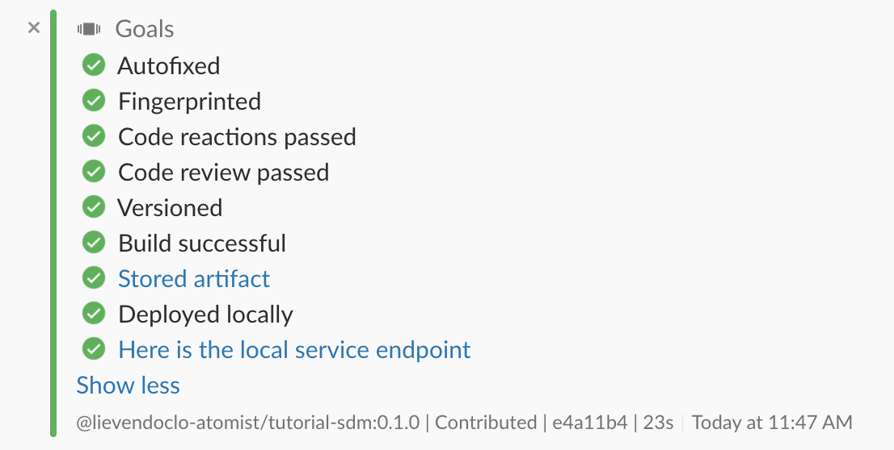

# Creating a new project through the SDM

The seed SDM is capable of creating new projects based on an existing project that can be used as a seed, just like you could do with the seed SDM itself.

One of the skills that you'll see with your new SDM is:

```
create spring
```

This intent will generate a new project based on another GitHub repository (by default `atomist-seeds/spring-rest-seed`), and change a couple of things in the POM and code in order to customize it. For example, it will change the package structure to one that you can define and rename some the classes.

So type in:

```
@atomist create spring
```

Atomist will first ask you the name of your new repository where you want to create the seed. Next, it will ask for a root package. This package will be used to restructure the packages in the newly created project. Atomist will then show you a summary of the parameters it will use for the new project generation. You can change all those things using the `set <param> <value>` command. If you click submit, it will now start generating the project.

## Atomist doing its thing

After the generation has completed, Atomist will ask you whether you want to create a channel for your new project. Click to confirm. In this new channel, you'll now see Atomist starting off a build on your own SDM. In the end, you'll be presented with this:

