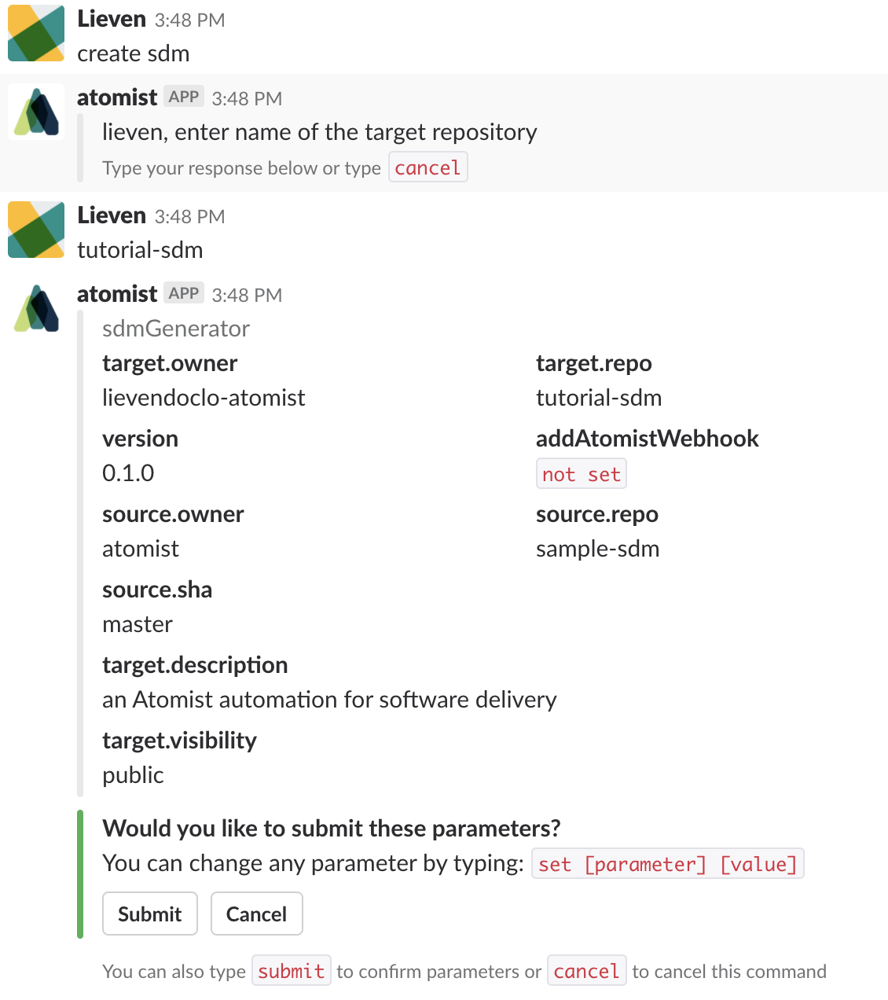
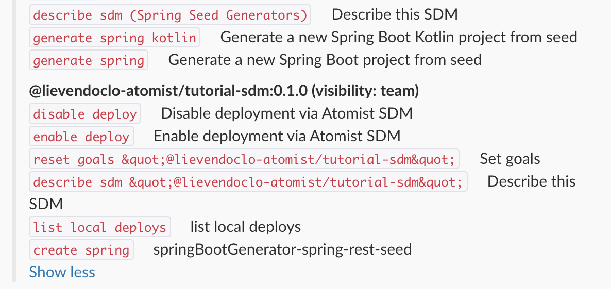

# Creating a new automation client

Automation clients are the bread and butter of Atomist. They provide the functionality Atomist can use to perform automations. A software delivery machine, or SDM for short, is an automation client that, as the name suggest, adds functionality to deliver software. 

SDMs can do a lot of things, from building software using various build mechanisms to fixing code automatically and even deploying your software across multiple environments.

## Creating a new SDM

Atomist provides the functionality right out of the box to create a brand new SDM, based on an existing one. This mechanism allows you to quickly build a new SDM but with the same base functionality. This process is called seeding.

When you go into your Slack workspace where Atomist is installed, type the following in any room or directly in the `atomist` bot direct messaging channel.

```
@atomist list skills
```

The Atomist bot will reply with all the intents (or chat commands) it can currently handle. In this case, as you do not have your own automation client running against your Atomist account, it will show the different automation clients Atomist provides out of the box.

One of these commands is `create sdm`. This will create a brand new SDM based on a seed. So type in:

```
@atomist create sdm
```

Atomist will now reply to this message and ask you a couple of questions. If you have multiple GitHub organisations coupled to your GitHub account, it will ask you in which organisation the new SDM needs to be placed. It will then ask you for a name for your SDM. Pick a name. After this, Atomist will show you a recap of all the settings it will use to create the new SDM.



As you can see, it will use the `sample-sdm` as a source - or seed - repository. However, this repository may be a bit overwhelming to use as a starting SDM, so let's use `seed-sdm` as a starting point, which is more lean. 

```
set source.repo seed-sdm
```

If you now click `Submit` it will create a new SDM in your GitHub repository.

Atomist will ask you whether you want to make a dedicated channel for this new SDM repository. Click the button to confirm.

## Running the new SDM

First of all, clone your new SDM repository to your machine

``` bash
git clone <git SDM repo location>
```

As we mentioned in the 'Getting started' step, automation clients are NodeJS applications. So once the repository is cloned, go into the directory and call:

``` bash
npm install
```

This will install all the necessary Node modules needed for the SDM.


To run the automation clients, you can use the npm scripts provided by the `package.json`, but there's an easier way. Atomist provides a CLI, which you can install using this command:

``` bash
npm install -g @atomist/automation-client
```

The SDM needs to have a bit of configuration in order to know how it needs to connect to your Atomist workspace. So run the following command:

``` bash
atomist config
```

And enter all the information asked in the prompt. You can find your Workspace ID in the settings screen of your workspace in the web UI ([https://app.atomist.com](https://app.atomist.com)).

Once all the information has been provided, you can start the SDM.

``` bash
atomist start
```

## Checking the SDM functionality in Slack

Once the SDM has started up, you can ask Atomist to list the skills again.

```
@atomist list skills
```

In the list, you should now see your new SDM automation client in the reply.

